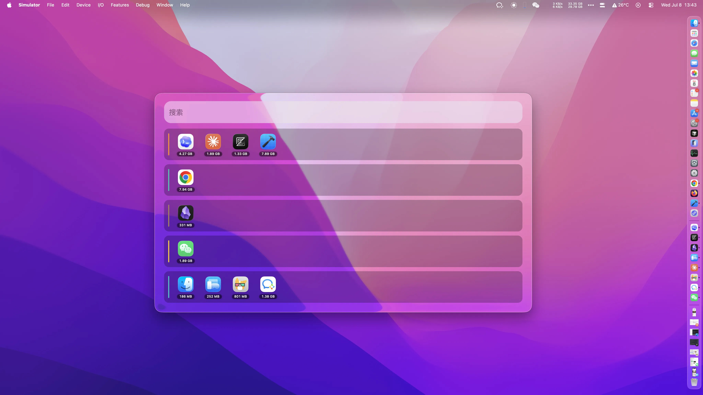
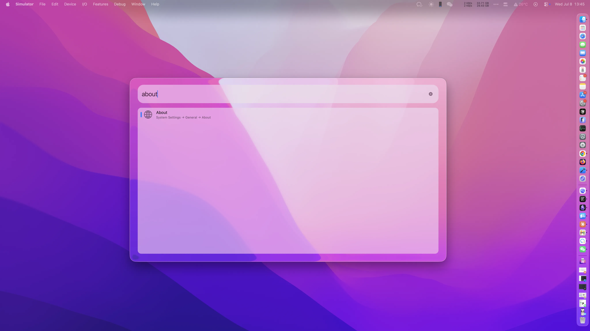

# ActivateDock

ActivateDock is a macOS launcher for quickly switching running apps, opening installed apps, searching the web, and running Alfred-style workflows from one floating panel.



## Features

- Global activation shortcut.
- Experimental four-finger swipe down trigger.
- Running app groups with memory badges.
- Search installed apps, including system apps such as Safari.
- Built-in web search commands: `google`, `baidu`, and `bing`.
- System Settings quick commands, such as `about`, `battery`, `bluetooth`, `privacy`, `storage`, and `software update`.
- Alfred-style workflow import and execution for Script Filter / keyword-driven workflows.
- Plugin settings UI for workflow variables, keyword conflicts, and load diagnostics.

## Screenshots




All README image assets live in [`img/`](img/).

## Install

Build and install the app into `/Applications`:

```bash
./build.sh --install
```

The script builds the Release app, writes a distributable copy into `dist/`, zips it, stops a running `ActivateDock` process if needed, and replaces `/Applications/ActivateDock.app`.

For local development without installing:

```bash
./run.sh
```

## Usage

Open ActivateDock with the configured shortcut or the optional four-finger swipe down gesture. Type to search apps, commands, web shortcuts, or imported workflow keywords.

Examples:

```text
safari
google swift appkit
about
yd 你好
```

Press Enter to open the selected result. Use arrow keys to move through results.

## Settings

Open settings from the menu bar item.

- Activation Shortcut: change the global hotkey.
- Accessibility Permission: lets ActivateDock restore minimized windows when switching apps.
- Four-finger swipe down: experimental global trackpad trigger powered by `OpenMultitouchSupport`.
- Plugins: import Alfred-style workflows, edit variables, and resolve keyword conflicts.

## Plugin Support

ActivateDock can import `.alfredworkflow` or `.zip` workflow bundles. Imported workflows are stored locally under:

```text
~/Library/Application Support/ActivateDock/Plugins/
```

The runtime focuses on common Alfred workflow pieces:

- `input.scriptfilter`
- `input.keyword`
- `input.listfilter`
- `action.script`
- `action.openurl`
- `action.copytoclipboard`
- `utility.argument`
- `utility.junction`

See [`docs/alfred-plugin-support.md`](docs/alfred-plugin-support.md) and [`docs/workflow-graph-runtime.md`](docs/workflow-graph-runtime.md) for implementation notes and current compatibility limits.

## Gesture Caveat

The four-finger swipe trigger is intentionally marked experimental. It uses `OpenMultitouchSupport`, which wraps Apple's private `MultitouchSupport.framework`. This is suitable for direct distribution, not Mac App Store submission. If the gesture conflicts with Mission Control or App Expose, adjust macOS trackpad settings.

## Development

Resolve packages and build with Xcode or the included scripts:

```bash
xcodebuild -resolvePackageDependencies -project ActivateDock.xcodeproj -scheme ActivateDock
./build.sh
./build.sh --install
```

The app currently targets macOS and has App Sandbox disabled because plugin execution and global multitouch monitoring require capabilities that do not fit the sandboxed Mac App Store model.
