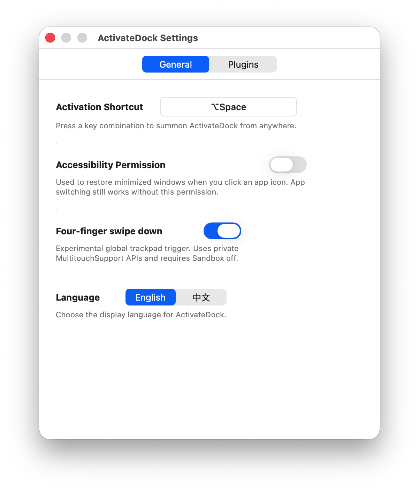
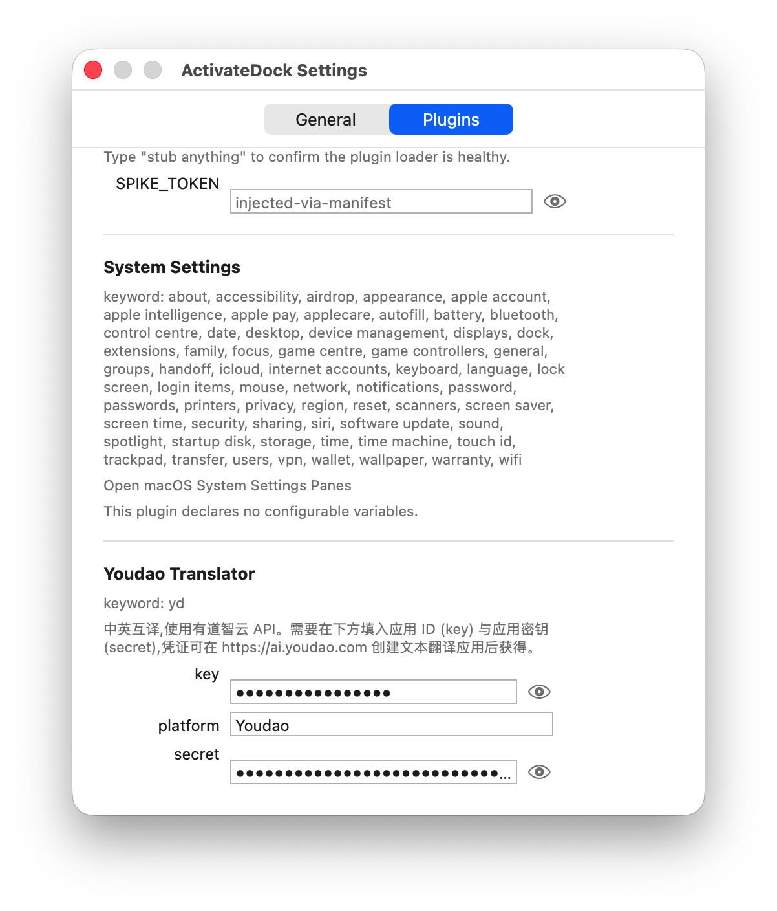

# ActivateDock

ActivateDock is a macOS launcher for switching apps, opening installed apps, searching the web, opening System Settings, and running Alfred plugins from one floating panel.


## Features

- Open ActivateDock from anywhere with a global shortcut.
- Optionally open ActivateDock with a four-finger swipe down gesture.
- Switch between running apps and reopen minimized windows.
- Search installed apps, including system apps such as Safari.
- Search the web with `google`, `baidu`, and `bing`.
- Open System Settings panes by typing names such as `battery`, `bluetooth`, `privacy`, `storage`, or `software update`.
- Import Alfred plugins and use their keywords from ActivateDock.
- Configure plugin variables and keyword conflicts in Settings.

## Screenshots

| Plugin search result | System Settings command |
| --- | --- |
|  |  |
| Settings general page | Settings plugins page |
|  |  |

## Install

1. Download the latest `ActivateDock-*.zip` package from [Releases](https://github.com/xs0521/ActivateDock/releases).
2. Unzip it.
3. Drag `ActivateDock.app` into `/Applications`.

Before opening ActivateDock for the first time, run:

```bash
sudo xattr -r -d com.apple.quarantine /Applications/ActivateDock.app
```

## Usage

Open ActivateDock with your shortcut or the optional four-finger swipe gesture. Type an app name, command, web search, System Settings name, or Alfred plugin keyword.

Examples:

```text
safari
google swift appkit
about
yd 你好
```

Press Enter to open the selected result. Use arrow keys to move through results.

## Settings

Open settings from the menu bar item.

- Activation Shortcut: change the global hotkey.
- Accessibility Permission: restore minimized windows when switching apps.
- Four-finger swipe down: turn the optional trackpad gesture on or off.
- Language: switch between English and Chinese.
- Plugins: import Alfred plugins, edit variables, and resolve keyword conflicts.

## Alfred Plugins

ActivateDock supports importing Alfred plugins.

## Note

The four-finger swipe gesture is experimental. If it conflicts with macOS gestures, turn it off in Settings.
